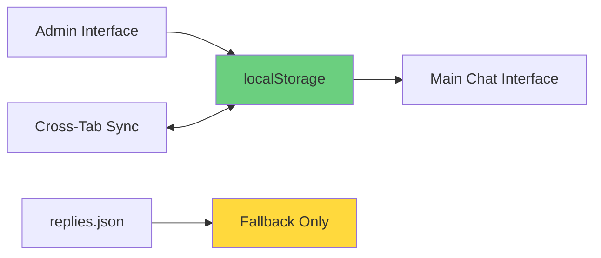

# Chat Assistant v3 - Fixed Version

## 🔧 **Fixes Applied**

This version fixes the **admin interface persistence issue** where new prompts and responses added through the admin panel were not available in the main chat interface.

### **Problem Solved**
- ❌ **Before**: Admin changes saved only to localStorage, but chat interface loaded from JSON file
- ✅ **After**: Chat interface prioritizes localStorage over JSON file, making admin changes immediately available

### **Technical Changes**

#### **1. Modified [`assets/js/matcher.js`](assets/js/matcher.js)**
- **localStorage-First Loading**: Checks localStorage before falling back to JSON file
- **Cross-Tab Synchronization**: Automatically updates rules when localStorage changes in other tabs
- **Enhanced Debug Functions**: Added `getRulesSource()` and `reloadRules()` methods

#### **2. Enhanced [`admin.html`](admin.html)**
- **Persistence Status Display**: Shows whether rules are loaded from localStorage or JSON
- **Better User Feedback**: Clear indication when rules are saved and active
- **Reset Functionality**: Button to clear localStorage and return to default rules
- **Test Connection**: Quick link to test changes in the chat interface

#### **3. Updated [`assets/js/app.js`](assets/js/app.js)**
- **Extended Debug Functions**: Added localStorage management and rule source checking
- **Better Testing Tools**: Functions to clear localStorage and reload rules

## 🚀 **How to Use**

### **For UX Testers**
1. **Open [`admin.html`](admin.html)** to manage prompts and responses
2. **Add new prompts** - they're immediately saved to localStorage
3. **Switch to [`index.html`](index.html)** - your new prompts are available instantly
4. **Test your prompts** by copying and pasting the exact text

### **For Developers**
- **Debug Console**: Use `window.debugChat` functions to inspect rules and sources
- **Rule Source Check**: `debugChat.getRulesSource()` shows where rules are loaded from
- **Manual Reload**: `debugChat.reloadRules()` refreshes rules from localStorage
- **Reset**: `debugChat.clearLocalStorage()` removes custom rules

## 🔄 **Data Flow (Fixed)**

## ✅ **Testing the Fix**

1. **Open [`admin.html`](admin.html)**
2. **Add a new prompt**: e.g., "Test prompt for UX study"
3. **Add response**: e.g., "This is a test response that should appear immediately"
4. **Click "Add Response"** - you should see "Rules saved to localStorage!"
5. **Open [`index.html`](index.html)** in a new tab
6. **Type the exact prompt** - you should get your custom response

## 🎯 **Key Benefits**

- ✅ **Immediate Persistence**: Admin changes are instantly available
- ✅ **Cross-Tab Sync**: Changes sync across browser tabs automatically
- ✅ **No Server Required**: Pure client-side solution
- ✅ **Backward Compatible**: Still works with original JSON file
- ✅ **Easy Reset**: Clear localStorage to return to defaults
- ✅ **Better UX Testing**: Testers can add prompts and test immediately

## 🔧 **Technical Notes**

- **localStorage Priority**: Chat interface checks localStorage first, then JSON file
- **Automatic Sync**: Uses browser `storage` events for cross-tab communication
- **Fallback System**: Gracefully falls back to JSON file if localStorage is empty
- **Debug Tools**: Enhanced debugging functions for development and testing

---

**Original Issue**: Admin interface changes were ephemeral and didn't persist to the main chat interface.

**Solution**: localStorage-first approach with cross-tab synchronization, making admin changes immediately available in the chat interface without requiring server-side persistence.